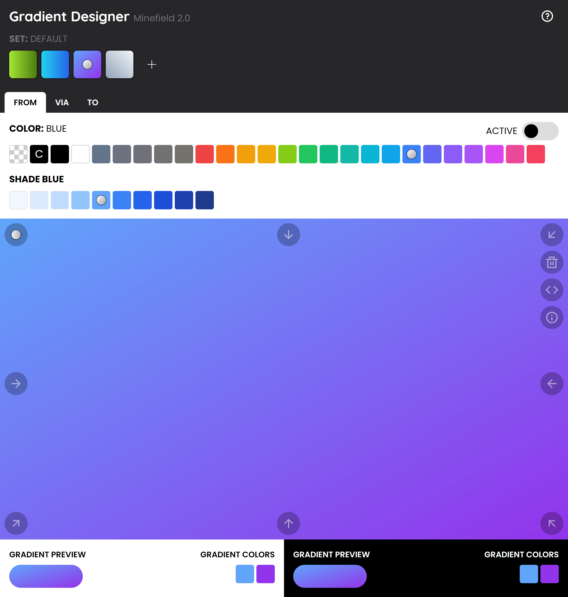

# Gradient Designer

**Version 2** - [Changelog](CHANGELOG.md)

**[Old version 1 - For Tailwind 1](https://gradient-designer.csspost.com/v1.0/)**

**Visit [Gradient Designer](https://gradient-designer.csspost.com/).**

## In short

- Design gradients and store them locally (local storage)
- Uses the colors and shades from TailwindCSS 2
- Export the code as TailwindCSS classes or native CSS
- 26 colors and 220 shades to choose from
- Maximal use of screen space

## Usage

### Gradient - Add

Add a gradient with the plus sign at the top. When you have added the gradient, click on it to select it.

### Gradient - Colors

When you have a gradient selected, you will see three tabs.

The first color is the "from" color. It's required in order for the gradient to work. The middle color is called "via" and the last is called "to".

There is also a "active" switch to toggle the color on or off. Make sure that at least the "from" color is active.

### Gradient - Shades

For most of the colors there are also 10 different shades. Transparent, current, black and white does not have any shades.

### Gradient - Preview

There is a big preview area showing the gradient. Below it are preview boxes to show how the gradient work as a button and which individual colors are used.

### Gradient - Directions

You can change the gradient direction by using the arrows placed on the gradient preview.

### Gradient - Delete

You can delete the gradient by using the trash icon placed on the gradient preview.

### Gradient - Code

When you are satisfied with your gradient, you can get the code for it.

You can get the code as Tailwind classes or as native CSS.

If you use Tailwind and need it with pseudo classes, you can use the prefix feature.

### Gradient - Info

If you want, you can give the gradient a name. You can do that by clicking the info icon on the gradient preview.

## Report issues

Please report any issues you encounter.

## Donate

Donate to [DevoneraAB](https://www.paypal.me/DevoneraAB) to support my work.

## License

The tool is free to use
